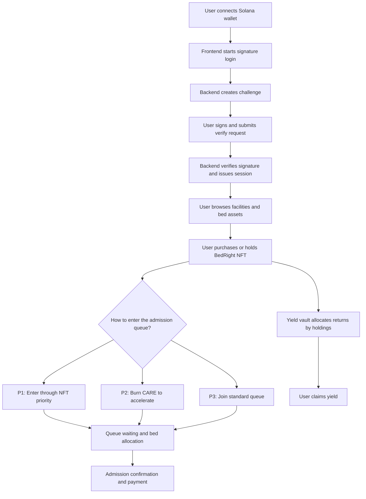
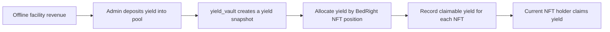
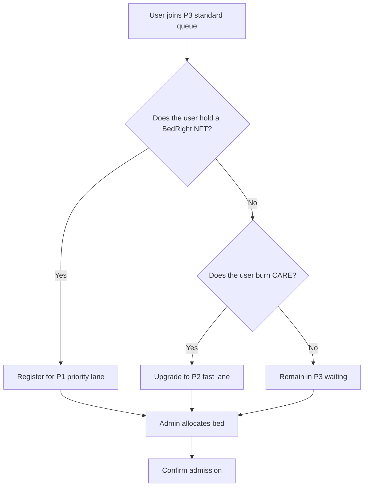

# CareChain

CareChain is a Web3 RWA project focused on healthcare and eldercare bed assets. It combines a frontend application, a backend service layer, and Solana smart contracts to bring nursing facility bed rights on-chain. The project models bed ownership as `BedRight NFT`s and connects them with priority admission queues, `$CARE` burn-based acceleration, and yield vault distribution, forming a full lifecycle from asset issuance to ownership, admission, and yield settlement.

## Overview

The main goal of CareChain is to tokenize offline healthcare and eldercare bed assets and manage ownership, queue priority, and yield distribution transparently through on-chain logic.

The repository currently contains three major parts:

- `frontend`: a `Next.js 16 + React 19 + pnpm` frontend for facility discovery, portfolio views, queue status, and asset management.
- `backend`: a `Spring Boot 2.7 + MySQL + Redis` backend for wallet authentication, facility data, portfolio APIs, queue operations, and payment flows.
- `contract/carechain`: an `Anchor 0.32.1` Solana contract workspace containing the `carechain`, `priority_queue`, and `yield_vault` programs.

## Core Capabilities

- Facility and bed asset presentation: browse healthcare facilities, capacity, occupancy, yields, and purchasable bed assets.
- BedRight NFT minting: represent bed rights as NFTs for ownership and admission privilege recognition.
- Wallet-based authentication: sign-in flow built on Solana wallet challenge/verify.
- Three-lane priority queue: supports `P1 NFT priority`, `P2 $CARE burn acceleration`, and `P3 standard queue`.
- Yield vault distribution: inject facility yield, allocate it to NFT positions, and let holders claim earnings.
- Portfolio and asset management: view holdings, yield trends, NFTs, and account-level summaries.

## Architecture

```text
Frontend (Next.js)
    |
    | HTTP API / Wallet Interaction
    v
Backend (Spring Boot)
    |
    | Query / Sync / Business Orchestration
    v
Solana Contracts (Anchor)
  - carechain
  - priority_queue
  - yield_vault
```

### Contract Responsibilities

- `carechain`: initializes facilities, creates bed classes, and mints BedRight NFTs.
- `priority_queue`: manages P1/P2/P3 queueing, burn-based upgrades, bed allocation, and admission confirmation.
- `yield_vault`: manages yield pool initialization, yield deposits, allocation, and claim flows.

## Main Functional Flow Diagrams

### 1. Main User Flow



### 2. Yield Distribution Flow



### 3. Queue Upgrade Flow



## Project Structure

```text
CareChain/
├── README.md
├── frontend/                 # Next.js frontend
├── backend/                  # Spring Boot backend
├── contract/
│   └── carechain/            # Anchor contract workspace
└── CONTRACT_TEST_GUIDE.md    # Contract testing guide
```

## Deployment

The following instructions focus on local development deployment, suitable for running the frontend, backend, and contract testing stack together.

### 1. Requirements

- Node.js `>= 22.15.0`
- `pnpm >= 8.15.6`
- JDK `17`
- Maven `3.8+`
- MySQL `8.x`
- Redis `6.x` or higher
- Rust / Solana CLI / Anchor CLI `0.32.1`

### 2. Backend Setup

The backend configuration is defined in `backend/src/main/resources/application.yml`. By default, it runs on port `8080` and depends on MySQL and Redis.

#### Default Configuration

- MySQL: `jdbc:mysql://localhost:3306/carechain`
- MySQL username: `root`
- MySQL password: `root1234`
- Redis Host: `127.0.0.1:6379`
- Redis password: `root1234`

#### Start the Backend

1. Create a database named `carechain`
2. Start MySQL and Redis
3. Run:

```bash
cd backend
mvn spring-boot:run
```

#### Build Command

```bash
cd backend
mvn clean package
```

#### Health Check

After startup:

```text
http://localhost:8080/actuator/health
```

### 3. Frontend Setup

The frontend connects to the backend through `NEXT_PUBLIC_API_BASE_URL`.

#### Recommended Environment Variable

Create `.env.local` under `frontend`:

```bash
NEXT_PUBLIC_API_BASE_URL=http://localhost:8080/api/v1
```

#### Start the Frontend

```bash
cd frontend
pnpm install
pnpm dev
```

The frontend runs by default at:

```text
http://localhost:3000
```

#### Build Command

```bash
cd frontend
pnpm build
```

### 4. Contract Setup and Testing

The contract workspace is located at `contract/carechain` and is managed with `Anchor`. The current `Anchor.toml` provider is set to `localnet`.

#### Install Dependencies

```bash
cd contract/carechain
yarn install
```

#### Build Contracts

```bash
anchor build
```

#### Run Queue Tests

```bash
yarn test:queue
```

#### Run Yield Vault Tests

```bash
yarn test:yield-vault
```

### 5. Recommended Local Startup Order

1. Start MySQL and Redis
2. Start the `backend`
3. Start the `frontend`
4. If contract interaction is needed, start Solana localnet / Anchor test environment

## Key API Overview

### Authentication

- `POST /api/v1/auth/challenge`
- `POST /api/v1/auth/verify`
- `GET /api/v1/auth/me`

### Facilities and Assets

- `GET /api/v1/facilities`
- `GET /api/v1/facilities/{facilityId}`
- `GET /api/v1/facilities/{facilityId}/assets`
- `GET /api/v1/facilities/{facilityId}/queue-status`

### Portfolio

- `GET /api/v1/portfolio/summary`
- `GET /api/v1/portfolio/yield-trend`
- `GET /api/v1/portfolio/assets`
- `GET /api/v1/portfolio/yield`
- `GET /api/v1/portfolio/nfts`

### Queue and Payment

- `POST /api/v1/queue-applications/preview`
- `POST /api/v1/queue-applications`
- `POST /api/v1/queue-burn-orders/preview`
- `POST /api/v1/queue-burn-orders`
- `GET /api/v1/queue/global`
- `GET /api/v1/queue/status`
- `POST /api/v1/payments/check-in/preview`
- `POST /api/v1/payments/check-in`

## Current Pages

- `/`: landing page introducing the RWA healthcare narrative, yield model, and queue mechanism.
- `/facilities`: facility listing page.
- `/facilities/[id]`: facility detail page showing yield, occupancy, bed assets, and queue status.
- `/facilities/assets`: asset management page for user-held BedRight NFTs.
- `/dashboard`: portfolio summary and yield trend page.
- `/priority-queue`: priority queue and `$CARE` burn-upgrade page.

## Notes

- The `CARE_MINT_ADDRESS` in the frontend is still placeholder-like and should be replaced with the actual mint address before production use.
- The backend `auth.jwt-secret` and the default database/Redis passwords are for local development only and must be replaced in production.
- `Anchor.toml` already includes localnet and devnet program IDs, but they should be revalidated before formal deployment.

## License

This repository does not currently define a full root-level licensing policy. If you plan to publish it externally, it is recommended to add a unified license file and production deployment notes.
