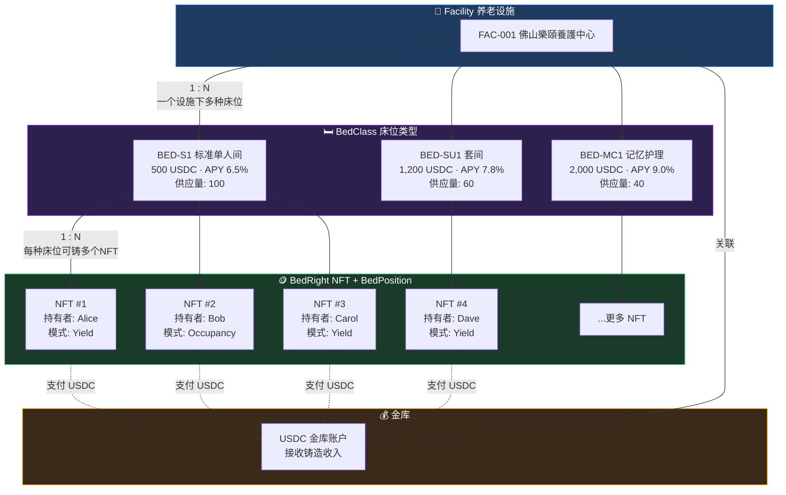

# CareChain BedRight NFT 铸造说明

## 目录

- [概述](#概述)
- [设施 · 床位类型 · NFT 映射关系图](#设施--床位类型--nft-映射关系图)
- [前置条件](#前置条件)
- [完整操作流程](#完整操作流程)
  - [步骤一：初始化养老设施 (Initialize Facility)](#步骤一初始化养老设施-initialize-facility)
  - [步骤二：创建床位类型 (Create Bed Class)](#步骤二创建床位类型-create-bed-class)
  - [步骤三：铸造 BedRight NFT (Mint BedRight NFT)](#步骤三铸造-bedright-nft-mint-bedright-nft)
- [链上账户结构](#链上账户结构)
- [错误码说明](#错误码说明)
- [常见问题](#常见问题)

---

## 概述

CareChain 协议将养老设施的床位使用权与收益权代币化为 **BedRight NFT**。每枚 NFT 对应一张具体床位，持有者可在「收益模式」与「入住模式」间切换。

**铸造 NFT 使用 USDC 支付**，价格由对应的 BedClass（床位类型）决定。

铸造流程分为三步：
1. **管理员**初始化养老设施（Facility）
2. **管理员**在设施下创建床位类型（BedClass）
3. **用户**选择床位类型，支付 USDC 铸造 NFT

### 角色权限说明

- **初始化养老设施** — `authority` 签名，且 Facility 的 `authority` 字段会记录管理员地址
- **创建床位类型** — 有 `has_one = authority` 约束，必须是设施管理员才能操作

这两个操作都是**管理员专属操作**，应该在管理后台完成。只有**铸造 NFT（Mint BedRight NFT）** 是面向普通用户的。

> 目前前端把三个操作放在同一个 App 里主要是为了**开发测试方便**。正式产品中理想的架构如下：

| 操作 | 面向角色 | 入口 |
|------|---------|------|
| Initialize Facility | 管理员 | 管理后台 |
| Create Bed Class | 管理员 | 管理后台 |
| Mint BedRight NFT | 普通用户 | 用户端 DApp |

---

## 设施 · 床位类型 · NFT 映射关系图



### 映射关系说明

| 关系 | 类型 | 说明 |
|------|------|------|
| Facility → BedClass | **一对多** | 一个养老设施下可创建多种床位类型（标准间、套间、记忆护理等） |
| BedClass → NFT | **一对多** | 每种床位类型可铸造多个 NFT，数量上限由 `total_supply` 控制 |
| NFT ↔ BedPosition | **一对一** | 每个 NFT 对应唯一一个 BedPosition 持仓账户，记录模式和状态 |
| Facility → Treasury | **一对一** | 每个设施关联一个金库 USDC 账户，所有铸造收入汇入该账户 |
| User → NFT | **铸造时** | 用户支付 USDC 到金库，获得 NFT + BedPosition |

### 铸造流程时序图

```mermaid
sequenceDiagram
    participant Admin as 👤 管理员
    participant User as 👤 用户
    participant Program as 📋 CareChain 合约
    participant Treasury as 💰 金库

    rect rgb(30, 58, 95)
        Note over Admin,Program: 步骤一：初始化设施
        Admin->>Program: initialize_facility(FAC-001, 佛山樂頤, 佛山, 200)
        Program-->>Program: 创建 Facility PDA 账户
    end

    rect rgb(45, 31, 78)
        Note over Admin,Program: 步骤二：创建床位类型
        Admin->>Program: create_bed_class(FAC-001, BED-S1, 标准间, 500 USDC)
        Program-->>Program: 创建 BedClass PDA 账户
        Admin->>Program: create_bed_class(FAC-001, BED-SU1, 套间, 1200 USDC)
        Program-->>Program: 创建 BedClass PDA 账户
    end

    rect rgb(26, 58, 42)
        Note over User,Treasury: 步骤三：用户铸造 NFT
        User->>Program: mint_bedright_nft(FAC-001, BED-S1)
        Program->>Program: 校验 minted_supply < total_supply
        Program->>Treasury: transfer 500 USDC（用户 → 金库）
        Program->>Program: mint_to 铸造 1 枚 NFT
        Program->>Program: 创建 BedPosition（默认 Yield 模式）
        Program->>Program: minted_supply += 1, sold_nfts += 1
        Program-->>User: NFT 到账 ✅
    end
```



---

## 前置条件

| 条件 | 说明 |
|------|------|
| Solana 钱包 | 需要 Phantom 等兼容钱包，且有足够 SOL 支付交易手续费 |
| USDC 代币 | 用户钱包需持有足够的 USDC（测试网可使用模拟 USDC） |
| USDC ATA | 用户和金库都需要拥有对应的 USDC 关联代币账户（ATA） |
| 合约部署 | CareChain 程序已部署到devnet网络（Program ID: `CqPp16dBjmgK5QN4ftThjWeW1Kkx5oGuHzRmvLPGKnJ4`） |

---

## 完整操作流程

### 步骤一：初始化养老设施 (Initialize Facility)

> **执行者：管理员**
> 
> 每个养老设施只需初始化一次，初始化后不可重复创建同一 ID 的设施。

#### 指令名称

`initialize_facility`

#### 指令参数

| 参数 | 类型 | 说明 | 示例 |
|------|------|------|------|
| `facility_id` | String | 设施唯一标识符，最长 32 字符 | `"FAC-001"` |
| `name` | String | 设施名称，最长 64 字符 | `"佛山樂頤養護中心"` |
| `city` | String | 所在城市，最长 32 字符 | `"佛山"` |
| `total_beds` | u16 | 该设施的总床位数 | `200` |

#### 账户列表

| 账户 | 说明 | 是否可变 | 是否签名 |
|------|------|---------|---------|
| `authority` | 管理员钱包地址，作为设施管理者 | ✅ | ✅ |
| `facility` | 设施 PDA 账户（自动创建） | ✅ | ❌ |
| `treasury` | 金库 USDC 代币账户地址，用于接收 NFT 铸造收入 | ❌ | ❌ |
| `system_program` | Solana System Program | ❌ | ❌ |

#### PDA 推导

```
facility PDA = findProgramAddress(["facility", facility_id], PROGRAM_ID)
```

#### 前端调用示例

```typescript
const [facilityPda] = PublicKey.findProgramAddressSync(
  [Buffer.from("facility"), Buffer.from(facilityId)],
  program.programId
);

await program.methods
  .initializeFacility(facilityId, name, city, totalBeds)
  .accounts({
    authority: wallet.publicKey,
    facility: facilityPda,
    treasury: new PublicKey(treasuryAtaAddress),
    systemProgram: SystemProgram.programId,
  })
  .rpc();
```

#### 创建后的 Facility 账户字段
> 创建后的 Facility 账户字段指的是当你调用 initialize_facility 指令成功后，链上创建的 Facility PDA 账户里存储了哪些数据。

| 字段 | 类型 | 说明 |
|------|------|------|
| `authority` | Pubkey | 管理员地址，拥有该设施的管理权限 |
| `facility_id` | String | 设施唯一标识符 |
| `name` | String | 设施名称 |
| `city` | String | 所在城市 |
| `total_beds` | u16 | 总床位数量 |
| `sold_nfts` | u16 | 已铸造（售出）的 NFT 数量，初始为 0 |
| `occupancy_rate` | u16 | 入住率（basis points, 0–10000 对应 0%–100%），初始为 0 |
| `treasury` | Pubkey | 金库 USDC 代币账户地址 |
| `bump` | u8 | PDA bump seed |

---

### 步骤二：创建床位类型 (Create Bed Class)

> **执行者：管理员（必须为 Facility 的 authority）**
>
> 一个设施下可创建多种床位类型（标准间、套间、记忆护理等）。

#### 指令名称

`create_bed_class`

#### 指令参数

| 参数 | 类型 | 说明 | 示例 |
|------|------|------|------|
| `facility_id` | String | 所属设施 ID，最长 32 字符 | `"FAC-001"` |
| `bed_class_id` | String | 床位类型唯一 ID，最长 32 字符 | `"BED-S1"` |
| `room_type` | String | 房间类型描述，最长 64 字符 | `"标准单人间"` |
| `care_tier` | String | 护理等级，最长 32 字符 | `"生活自理型"` |
| `price_usdc` | u64 | USDC 价格（**含小数精度**，USDC 有 6 位小数） | `500_000_000`（= 500 USDC） |
| `apy_bps` | u16 | 年化收益率（basis points, 1 bps = 0.01%） | `650`（= 6.5%） |
| `total_supply` | u16 | 该类型最大可铸造数量 | `100` |
| `privilege_level` | String | 特权等级，最长 16 字符 | `"P1"` |

> **⚠️ 注意 `price_usdc` 的精度**：USDC 在 Solana 上有 **6 位小数**。  
> - 500 USDC → 传入 `500_000_000`（500 × 10^6）  
> - 1,200 USDC → 传入 `1_200_000_000`  
> - 2,000 USDC → 传入 `2_000_000_000`

#### 账户列表

| 账户 | 说明 | 是否可变 | 是否签名 |
|------|------|---------|---------|
| `authority` | 管理员钱包地址（必须与设施的 authority 一致） | ✅ | ✅ |
| `facility` | 对应的设施 PDA | ❌ | ❌ |
| `bed_class` | 床位类型 PDA（自动创建） | ✅ | ❌ |
| `system_program` | Solana System Program | ❌ | ❌ |

#### PDA 推导

```
facility PDA  = findProgramAddress(["facility", facility_id], PROGRAM_ID)
bed_class PDA = findProgramAddress(["bed_class", facility_id, bed_class_id], PROGRAM_ID)
```

#### 前端调用示例

```typescript
const [facilityPda] = PublicKey.findProgramAddressSync(
  [Buffer.from("facility"), Buffer.from(facilityId)],
  program.programId
);

const [bedClassPda] = PublicKey.findProgramAddressSync(
  [Buffer.from("bed_class"), Buffer.from(facilityId), Buffer.from(bedClassId)],
  program.programId
);

await program.methods
  .createBedClass(
    facilityId,
    bedClassId,
    roomType,
    careTier,
    new BN(priceUsdc),      // 如 new BN("500000000")
    parseInt(apyBps),       // 如 650
    parseInt(totalSupply),  // 如 100
    privilegeLevel          // 如 "P1"
  )
  .accounts({
    authority: wallet.publicKey,
    facility: facilityPda,
    bedClass: bedClassPda,
    systemProgram: SystemProgram.programId,
  })
  .rpc();
```

#### 创建后的 BedClass 账户字段

| 字段 | 类型 | 说明 |
|------|------|------|
| `facility` | Pubkey | 所属设施的链上地址 |
| `facility_id` | String | 设施 ID |
| `bed_class_id` | String | 床位类型 ID |
| `room_type` | String | 房间类型描述 |
| `care_tier` | String | 护理等级 |
| `price_usdc` | u64 | USDC 铸造价格（含 6 位小数精度） |
| `apy_bps` | u16 | 年化收益率（basis points） |
| `total_supply` | u16 | 总供应量上限 |
| `minted_supply` | u16 | 已铸造数量，初始为 0 |
| `privilege_level` | String | 特权等级（P1 / P2 / P3） |
| `bump` | u8 | PDA bump seed |

#### 参考：三种标准床位类型

| 类型 | bed_class_id | 面值 | price_usdc 值 | APY | apy_bps |
|------|-------------|------|--------------|-----|---------|
| 标准间 | `BED-S1` | 500 USDC | `500000000` | 6.5% | `650` |
| 套间 | `BED-SU1` | 1,200 USDC | `1200000000` | 7.8% | `780` |
| 记忆护理 | `BED-MC1` | 2,000 USDC | `2000000000` | 9.0% | `900` |

---

### 步骤三：铸造 BedRight NFT (Mint BedRight NFT)

> **执行者：任意用户**
>
> 用户选择一个床位类型，支付对应的 USDC 价格，铸造一枚 BedRight NFT。

#### 指令名称

`mint_bedright_nft`

#### 指令参数

| 参数 | 类型 | 说明 | 示例 |
|------|------|------|------|
| `facility_id` | String | 目标设施 ID | `"FAC-001"` |
| `bed_class_id` | String | 目标床位类型 ID | `"BED-S1"` |

> 价格不需要传入，合约会自动从 BedClass 的 `price_usdc` 字段读取。

#### 账户列表

| 账户 | 说明 | 是否可变 | 是否签名 |
|------|------|---------|---------|
| `user` | 用户钱包地址（铸造者、付款人） | ✅ | ✅ |
| `facility` | 设施 PDA | ✅ | ❌ |
| `bed_class` | 床位类型 PDA | ✅ | ❌ |
| `mint_authority` | 铸币权限 PDA（程序控制） | ❌ | ❌ |
| `nft_mint` | NFT Mint 账户（每次铸造新生成 Keypair） | ✅ | ✅ |
| `user_nft_ata` | 用户的 NFT 关联代币账户（自动创建） | ✅ | ❌ |
| `bed_position` | 床位持仓 PDA（自动创建） | ✅ | ❌ |
| `usdc_mint` | USDC 代币的 Mint 地址 | ❌ | ❌ |
| `user_usdc_ata` | 用户的 USDC 关联代币账户 | ✅ | ❌ |
| `treasury_usdc_ata` | 金库的 USDC 代币账户（必须与 Facility.treasury 一致） | ✅ | ❌ |
| `metadata_account` | Metaplex Metadata PDA | ✅ | ❌ |
| `token_metadata_program` | Metaplex Token Metadata 程序 | ❌ | ❌ |
| `rent` | Solana Rent Sysvar | ❌ | ❌ |
| `token_program` | SPL Token 程序 | ❌ | ❌ |
| `associated_token_program` | SPL Associated Token 程序 | ❌ | ❌ |
| `system_program` | Solana System Program | ❌ | ❌ |

#### PDA 推导

```
facility PDA       = findProgramAddress(["facility", facility_id], PROGRAM_ID)
bed_class PDA      = findProgramAddress(["bed_class", facility_id, bed_class_id], PROGRAM_ID)
mint_authority PDA = findProgramAddress(["mint_authority"], PROGRAM_ID)
bed_position PDA   = findProgramAddress(["bed_position", nft_mint_pubkey], PROGRAM_ID)
metadata PDA       = findProgramAddress(["metadata", TOKEN_METADATA_PROGRAM_ID, nft_mint_pubkey], TOKEN_METADATA_PROGRAM_ID)
```

#### 合约执行流程

```
1. 校验 bed_class.minted_supply < bed_class.total_supply（未售罄）
       ↓
2. 从 bed_class.price_usdc 读取价格
       ↓
3. token::transfer: 用户 USDC ATA → 金库 USDC ATA（支付购买费用）
       ↓
4. token::mint_to: 通过 mint_authority PDA 铸造 1 枚 NFT 到用户 ATA
       ↓
5. 创建 BedPosition 账户（默认 Yield 收益模式）
       ↓
6. bed_class.minted_supply += 1, facility.sold_nfts += 1
       ↓
7. 创建 Metaplex Metadata（名称: CareChain BedRight, 符号: BED）
```

#### 前端调用示例

```typescript
import { Keypair, PublicKey, SystemProgram, SYSVAR_RENT_PUBKEY } from '@solana/web3.js';
import { getAssociatedTokenAddressSync, TOKEN_PROGRAM_ID, ASSOCIATED_TOKEN_PROGRAM_ID } from '@solana/spl-token';

const TOKEN_METADATA_PROGRAM_ID = new PublicKey("metaqbxxUerdq28cj1RbAWkYQm3ybzjb6a8bt518x1s");

// 1. 计算各个 PDA
const [facilityPda] = PublicKey.findProgramAddressSync(
  [Buffer.from("facility"), Buffer.from(facilityId)],
  program.programId
);

const [bedClassPda] = PublicKey.findProgramAddressSync(
  [Buffer.from("bed_class"), Buffer.from(facilityId), Buffer.from(bedClassId)],
  program.programId
);

const [mintAuthorityPda] = PublicKey.findProgramAddressSync(
  [Buffer.from("mint_authority")],
  program.programId
);

// 2. 生成新的 NFT Mint Keypair
const nftMintKeypair = Keypair.generate();

// 3. 计算关联代币账户 (ATA)
const usdcMint = new PublicKey("USDC_MINT_ADDRESS");
const userNftAta = getAssociatedTokenAddressSync(nftMintKeypair.publicKey, wallet.publicKey);
const userUsdcAta = getAssociatedTokenAddressSync(usdcMint, wallet.publicKey);

// 4. 从链上读取 Facility 的金库地址
const facilityAcc = await program.account.facility.fetch(facilityPda);
const treasuryUsdcAta = facilityAcc.treasury;

// 5. 计算 BedPosition 和 Metadata PDA
const [bedPositionPda] = PublicKey.findProgramAddressSync(
  [Buffer.from("bed_position"), nftMintKeypair.publicKey.toBuffer()],
  program.programId
);

const [metadataPda] = PublicKey.findProgramAddressSync(
  [Buffer.from("metadata"), TOKEN_METADATA_PROGRAM_ID.toBuffer(), nftMintKeypair.publicKey.toBuffer()],
  TOKEN_METADATA_PROGRAM_ID
);

// 6. 发起铸造交易
const tx = await program.methods
  .mintBedrightNft(facilityId, bedClassId)
  .accounts({
    user: wallet.publicKey,
    facility: facilityPda,
    bedClass: bedClassPda,
    mintAuthority: mintAuthorityPda,
    nftMint: nftMintKeypair.publicKey,
    userNftAta: userNftAta,
    bedPosition: bedPositionPda,
    usdcMint: usdcMint,
    userUsdcAta: userUsdcAta,
    treasuryUsdcAta: treasuryUsdcAta,
    metadataAccount: metadataPda,
    tokenMetadataProgram: TOKEN_METADATA_PROGRAM_ID,
    rent: SYSVAR_RENT_PUBKEY,
    tokenProgram: TOKEN_PROGRAM_ID,
    associatedTokenProgram: ASSOCIATED_TOKEN_PROGRAM_ID,
    systemProgram: SystemProgram.programId,
  })
  .signers([nftMintKeypair])  // NFT Mint Keypair 需要签名
  .rpc();
```

#### 铸造后生成的 BedPosition 账户字段

| 字段 | 类型 | 说明 |
|------|------|------|
| `owner` | Pubkey | NFT 持有者（铸造者）地址 |
| `mint` | Pubkey | NFT Mint 地址 |
| `facility` | Pubkey | 所属设施地址 |
| `bed_class` | Pubkey | 所属床位类型地址 |
| `facility_id` | String | 设施 ID |
| `bed_class_id` | String | 床位类型 ID |
| `mode` | BedMode | 当前模式，铸造后默认为 `Yield`（收益模式） |
| `last_mode_switch_ts` | i64 | 上次模式切换的 Unix 时间戳 |
| `active` | bool | 是否激活，铸造后为 `true` |
| `bump` | u8 | PDA bump seed |

#### BedMode 枚举

| 值 | 说明 |
|----|------|
| `Yield` | 收益模式 — 持有者自动获得 USDC 分润 |
| `Occupancy` | 入住模式 — 持有者可直接入住（P1 VIP 通道） |

#### 铸造后的 NFT Metadata

| 字段 | 值 |
|------|-----|
| name | `CareChain BedRight` |
| symbol | `BED` |
| uri | IPFS 托管的 JSON 元数据 |
| seller_fee_basis_points | `500`（5% 二级市场版税） |

#### NFT 元数据与图片更改说明

NFT 的图片和描述信息**不是直接存储在链上的**，而是通过 Metaplex Metadata 中的 `uri` 字段指向一个托管在 **IPFS（Pinata）** 上的 JSON 文件。链上只存储这个 JSON 的 URL。

##### 元数据 JSON 结构（存储在 Pinata IPFS 上）

```json
{
  "name": "CareChain BedRight",
  "symbol": "BED",
  "description": "CareChain BedRight NFT - tokenized healthcare bed ownership with yield and usage rights.",
  "image": "https://beige-capitalist-xerinae-88.mypinata.cloud/ipfs/bafybeiernl6nvakken74w7beufv3ptm7w2xjynknn4mccnbmtqdhdbcflu",
  "external_url": "https://carechain.example.com",
  "attributes": [
    {
      "trait_type": "Asset Type",
      "value": "Medical Bed"
    },
    {
      "trait_type": "Mode",
      "value": "Yield"
    },
    {
      "trait_type": "Protocol",
      "value": "CareChain"
    }
  ],
  "properties": {
    "files": [
      {
        "uri": "https://beige-capitalist-xerinae-88.mypinata.cloud/ipfs/bafybeiernl6nvakken74w7beufv3ptm7w2xjynknn4mccnbmtqdhdbcflu",
        "type": "image/png"
      }
    ],
    "category": "image"
  }
}
```

##### JSON 各字段含义

| 字段 | 类型 | 说明 |
|------|------|------|
| `name` | String | NFT 名称，显示在钱包和市场中 |
| `symbol` | String | NFT 符号/简称 |
| `description` | String | NFT 的详细描述文字 |
| `image` | URL | **NFT 展示图片的 IPFS 链接**，这是用户在钱包/市场看到的图片 |
| `external_url` | URL | 外部链接，点击可跳转到项目官网 |
| `attributes` | Array | NFT 属性列表，以 `trait_type` + `value` 键值对形式展示 |
| `attributes[].trait_type` | String | 属性名称（如 Asset Type、Mode、Protocol） |
| `attributes[].value` | String | 属性值（如 Medical Bed、Yield、CareChain） |
| `properties.files` | Array | 关联文件列表，包含文件 URI 和 MIME 类型 |
| `properties.files[].uri` | URL | 文件的 IPFS 链接（通常与 `image` 一致） |
| `properties.files[].type` | String | 文件 MIME 类型（如 `image/png`、`image/jpeg`） |
| `properties.category` | String | 资产类别（`image` / `video` / `audio`） |

##### 如何更改 NFT 图片

更改 NFT 图片需要修改**两个地方**：

**第 1 步：上传新图片到 Pinata IPFS**

1. 登录 [Pinata](https://app.pinata.cloud/)
2. 点击「Upload」上传新的 NFT 图片（建议 PNG/JPEG，推荐尺寸 1000×1000 px）
3. 上传完成后获取图片的 IPFS 链接，格式如：
   ```
   https://beige-capitalist-xerinae-88.mypinata.cloud/ipfs/bafy...新的CID...
   ```

**第 2 步：更新元数据 JSON 并上传**

1. 修改 JSON 文件中的 `image` 和 `properties.files[0].uri` 为新图片链接：
   ```json
   {
     "image": "https://你的网关.mypinata.cloud/ipfs/新图片CID",
     "properties": {
       "files": [
         {
           "uri": "https://你的网关.mypinata.cloud/ipfs/新图片CID",
           "type": "image/png"
         }
       ]
     }
   }
   ```
2. 将修改后的 JSON 文件上传到 Pinata，获取新的 JSON IPFS 链接

**第 3 步：修改合约中的 URI**

修改 `programs/carechain/src/instructions/mint_bedright_nft.rs` 第 177 行的 `uri` 字段：

```diff
  let data_v2 = DataV2 {
      name: "CareChain BedRight".to_string(),
      symbol: "BED".to_string(),
-     uri: "https://beige-capitalist-xerinae-88.mypinata.cloud/ipfs/bafkreigd2towxght2lw2wuty5z3t7kcc5fvheg26bvh5wfakcrlrdzza4i".to_string(),
+     uri: "https://你的网关.mypinata.cloud/ipfs/新JSON文件的CID".to_string(),
      seller_fee_basis_points: 500,
      creators: None,
      collection: None,
      uses: None,
  };
```

**第 4 步：重新编译部署合约**

```bash
anchor build
anchor deploy
```

> **⚠️ 注意**：修改合约中的 `uri` 后需要重新编译部署，此后铸造的**新 NFT** 会使用新图片。**已铸造的 NFT 不会受影响**，它们的 Metadata 已经写入链上，指向的仍然是旧的 URI。

##### 数据流向示意

```
链上 Metaplex Metadata
    └── uri: "https://pinata.cloud/ipfs/JSON文件CID"
              │
              ▼
    Pinata IPFS 上的 JSON 文件
        ├── name: "CareChain BedRight"
        ├── description: "..."
        └── image: "https://pinata.cloud/ipfs/图片CID"
                     │
                     ▼
              Pinata IPFS 上的图片文件 (PNG/JPEG)
                     │
                     ▼
            用户在 Phantom 钱包 / 交易市场 看到的 NFT 图片
```


## 错误码说明

| 错误 | 触发条件 |
|------|---------|
| `BedClassSoldOut` | 该床位类型的 `minted_supply` 已达到 `total_supply`，无法继续铸造 |
| `InvalidTreasury` | 传入的金库代币账户与 Facility 注册的 `treasury` 不一致 |

---

## 常见问题

**Q: 铸造 NFT 用什么代币支付？**  
A: **USDC**。价格由 BedClass 的 `price_usdc` 字段决定，USDC 在 Solana 上有 6 位小数。

**Q: SOL 在铸造中的作用是什么？**  
A: SOL 仅用于支付 Solana 网络交易手续费（gas）和创建链上账户的租金（rent），不参与业务支付。

**Q: 每次铸造需要生成新的 Keypair 吗？**  
A: 是的。每枚 NFT 都有独立的 Mint 账户，因此每次铸造需生成新的 `nftMintKeypair`，并将其作为 signer 传入交易。

**Q: 铸造后 NFT 默认是什么模式？**  
A: 默认为 **Yield（收益模式）**，持有者自动获得 USDC 分润。可后续切换为 Occupancy（入住模式），切换有 30 天冷却期。

**Q: 如何判断某个床位类型是否售罄？**  
A: 读取 BedClass 账户，当 `minted_supply >= total_supply` 时即为售罄。
